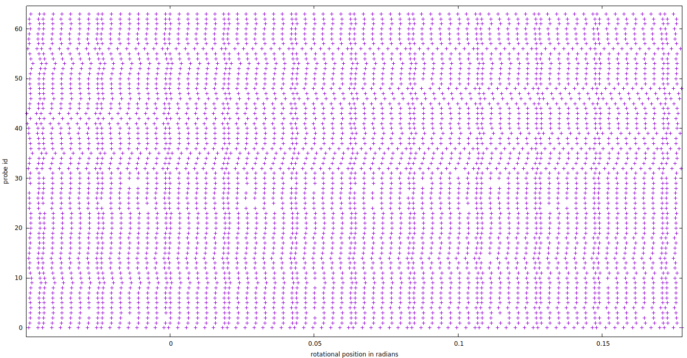

# ittik

An attempt to get back the original dense Velodyne sensor readings from the sparse point clouds of the KITTI dataset, by reverting the Velodyne calibration. 

This original dense data might be useful as input to convolutional neural networks. It could also be useful for geometric processing like SLAM, because it allows for more accurate timing, and lidar-ray projections.

However... something is still not correct, as can be seen in the following figure. The marks indicate the orientational positions of each ray for the the 64 probes. These positions should be aligned (well, slightly offset pairwise in a regular pattern), but they still have an error of up to ~7 milliradians.

The code is not that readable (sorry...) and uses some c++20 features; I used GCC 8.3.0 with `-std=c++2a`.
