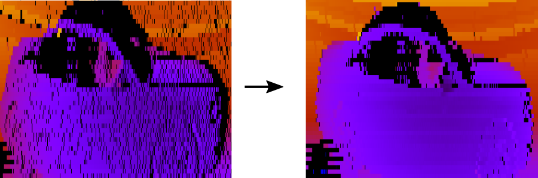

# ittik

ITTIK (I jusT wanT my kittI bacK) gets back the original dense Velodyne LiDAR sensor readings from the sparse point clouds of the KITTI dataset, by reverting the Velodyne calibration.

This dense data is useful as input to convolutional neural networks for object detection, semantic segmentation, etc. In addition, it is useful for geometric processing such as SLAM, because it allows for more accurate timing, and lidar-ray projections.

The following figure shows what is meant with original dense LiDAR sensor readings. On the left the often used "range images", in which point clouds were naively reprojected. On the right the actual dense LiDAR data, acquired by reverting the calibration using ITTIK :

All scans the 3D Object detection sets and the Odometry training sets have been processed. The discretized raw scan coordinates are made available here:

  <a href='http://www.beteuterd.nl/ittik/odo_sweep_coordinates.tgz'>Odometry training sets (gzip tar file 3.6GB)</a>.

  <a href='http://www.beteuterd.nl/ittik/object_sweep_coordinates.tgz'>3D Object detection sets (gzip tar file 2.4 GB)</a>.

There's also <a href='http://www.beteuterd.nl/ittik/odo_sweep_images'>images plotted using the raw scan coordinates colored</a> using the <a href='http://semantic-kitti.org/'>semantic kitti</a> labels.

The file format for the scan coordinates is binary in which for each point there's two 16-bit unsigned integer (uint16_t), the first corresponding to the horizontal coordinate and second to the vertical coordinate. See e.g. [/src/plot_range_image.cpp](./src/plot_range_image.cpp) to use the coordinates to plot a range image.

Unfortunately, ITTIK cannot deal with KITTI's motion corrected point-clouds (yet...). This is for example the case for the Odometry test sets.

Btw, the code is not that readable (sorry...) and uses some c++20 features (I used GCC 8.3.0 with `-std=c++2a -fconcepts`).
