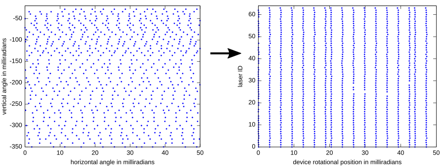

# ittik

ITTIK (I jusT wanT my kittI bacK) is an attempt to get back the original dense Velodyne sensor readings from the sparse point clouds of the KITTI dataset, by reverting the Velodyne calibration.

This dense data might be useful as input to convolutional neural networks for object detection, semantic segmentation, etc. It could also be useful for geometric processing such as SLAM, because it allows for more accurate timing, and lidar-ray projections.

The following figure shows the current status. On the left is the projection of a small piece of a raw KITTI point cloud and on the right that same piece after the calibration was reverted:

It is clear that the right is easier to discretize and use in a standard convolutional network.

Next up is reverting the motion correction used in most of the KITTI benchmarks.

The code is not that readable (sorry...) and uses some c++20 features (I used GCC 8.3.0 with `-std=c++2a`).
